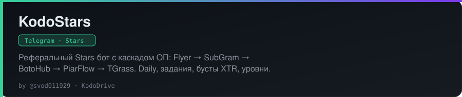

<!-- kododrive-readme-style -->

<div align="center">
  
</div>

<br/>

<div align="center">
  
</div>

<br/>

<p align="center">
  <a href="https://github.com/svod011929/KodoStars"></a>
  <a href="https://t.me/gveom"></a>
  <a href="https://github.com/svod011929"></a>
  
</p>

<!-- /kododrive-readme-style -->

# KodoStars

Telegram-бот на **Python 3.12 / aiogram 3**: реферальная экономика на внутренних Stars, ежедневки,
задания, промокоды, бусты за **Telegram Stars (XTR)**, очередь выводов с холдом средств и
полноценная **админ-панель внутри Telegram**.

Монетизация трафика — обязательная подписка (**только PiarFlow**): проверка устройства/твинков
до выдачи заданий, вебхук отписок со штрафом, реферальный бонус только после ≥N оплаченных
подписок PiarFlow. Выплата Stars пользователям — через **Fragment** (mnemonic + cookies).
UI использует Telegram **premium emoji** (`<tg-emoji>` в сообщениях, `icon_custom_emoji_id` на кнопках).
Эмодзи **валюты** (баланс, награды) задаётся через `CURRENCY_EMOJI_ID` / `CURRENCY_EMOJI_FALLBACK`
и меняется в рантайме: **Админка → Настройки** — numeric id, разметка
`<tg-emoji emoji-id="…">…</tg-emoji>` или вставка **custom_emoji** из Telegram (читается
`MessageEntity`).
**Название бота** в текстах подставляется автоматически из Telegram (`get_me().first_name`);
в шаблонах и тексте обслуживания — плейсхолдеры `{bot}` / `BOT`.
Меню пользователя и админки — **компактные хабы** (earn / social / money; операции / каталог /
трафик / система).

Интерфейс — русский. Выплаты пользователям — **только Telegram Stars**. CryptoBot нет.

Автор: [KodoDrive](https://github.com/svod011929) · Релиз: [v1.3.0](https://github.com/svod011929/KodoStars/releases/tag/v1.3.0)

## Что умеет бот

### Для пользователя

- `/start` и deep-link `ref_<tg_id>`; реферер привязывается **только при первом запуске** (защита от переатрибуции старых аккаунтов)
- Компактное главное меню: ежедневка / задания · профиль / рефералы · вывод / бусты · промо / топ / помощь (+ амбассадор и админка при доступе)
- Двухуровневая рефералка: бонус за активацию друга + процент с его заработка; уведомления «пришёл новый друг» и «друг активировался: +N ⭐»
- Активация реферала: чеклист в UI (активность + устройство + минимум **`REFERRAL_MIN_PIARFLOW_SUBS`**, по умолчанию 2, ресурсов PiarFlow со статусом `subscribed`)
- Кнопка **«Поделиться ссылкой»** (`t.me/share/url`) и место в топе рефереров
- Ежедневка с серией, экран-превью «сколько получу сегодня» и таймером до сброса
- Антифрод-кулдаун на claim (`CLAIM_COOLDOWN_SECONDS`) — только реальные действия «заработать», не stamp присутствия
- Задания: подписка на канал (проверка через `getChatMember`), приглашения, серии, переход по ссылке; автозачёт по событиям
- Уровни (XP → множитель до ×2) с прогресс-баром, бусты-множители и паки Stars за XTR
- Промокоды с лимитом активаций и сроком действия
- **Амбассадор**: несколько слотов (канал/чат/бот) → после одобрения полный кастом L1/L2 (берётся max по полям), гибридный дневной промокод и опциональный двухшаговый автопост
- Топ по рефералам и по заработку за 7 дней (ники маскируются)
- История операций с пагинацией, список заявок, отмена своей `pending`-заявки
- Вывод: выбор готового подарка Telegram по `star_count`, холд средств; для Fragment нужен `@username`
- `/menu`, `/profile`, `/help`, `/terms`, `/paysupport` (обязательные для ботов, принимающих Stars)

### Для администратора (`/admin`)

Корень админки — компактный хаб: операции · амбассадоры · каталог · PiarFlow · система · настройки.

| Раздел | Возможности |
| --- | --- |
| Статистика | пользователи всего/сегодня/7д/30д, регистрации по дням, DAU/WAU, баны и блокировки бота, воронка рефералов, экономика по видам начислений, холд, выводы, выручка XTR, **баланс Stars бота** (`getMyStarBalance`), сверка балансов с леджером, **PiarFlow трафик** (выдано / засчитано / конверсия) |
| Пользователи | поиск по ID/@username, карточка (баланс, холд, уровень, рефералы, платежи, выплаты, фрод, устройство), ±баланс с причиной, бан/разбан, заметка, сообщение пользователю, леджер, список рефералов, подозрительные рефереры, флаг «доверенный» |
| Выводы | очередь по статусам с пагинацией, карточка с контекстом пользователя, согласовать / отклонить с причиной / **Отправить через Fragment** или подтвердить ручную выплату; карточка новой заявки приходит админам сразу |
| Амбассадоры | очередь заявок, одобрение с кастомными L1/L2 и шаблоном дневного промо, chat_id + автопост (бот должен быть админом), отзыв |
| Рассылка | любой тип контента (`copyMessage`), опциональная URL-кнопка, аудитория (все / активные 7д / активированные), тест себе, фоновая отправка с rate-limit и обработкой `RetryAfter`, прогресс-карточка, остановка |
| Каталог | задания / бусты / промокоды — мастер создания, редактирование, вкл/выкл, мягкое удаление |
| Настройки | хабы: рефералы / награды / вывод / антитвинк / трафик / система — экономика (в т.ч. валютный emoji), BotoHub Views, антитвинк и операционные флаги — **без перезапуска**; валюту можно вставить как custom_emoji из чата |
| PiarFlow | тумблер провайдера в рантайме (`provider_states`) + статистика выданных/засчитанных спонсоров |
| Система | платежи (возврат через `refundStarPayment`), админы, журнал аудита, антифрод/твинки, экспорт/импорт CSV |

Режим обслуживания, поддержка и лимиты вывода — тоже переключаются из панели.

## Стек и архитектура

- aiogram 3.x, asyncio, FSM (MemoryStorage)
- SQLAlchemy 2 + aiosqlite (SQLite с WAL по умолчанию) или PostgreSQL (`asyncpg`)
- **Alembic**: миграции применяются автоматически на старте; старая БД, созданная через `create_all`, штампуется базовой ревизией и обновляется
- pydantic-settings (`.env`) + переопределения в таблице `app_settings`
- structlog (JSON или консоль), контекст `update_id`/`user_id` в каждой записи
- Premium emoji: каталог `app/bot/emoji.py`, исходящие `SendMessage`/`EditMessageText` проходят через request-middleware
- Brand: `app/bot/brand.py` — имя бота из `get_me`, плейсхолдеры `{bot}` / `BOT` в UI-текстах

Ключевые решения:

- **Баланс** — колонка `users.balance`, изменяемая одним атомарным `UPDATE … RETURNING`; леджер — полный журнал с `balance_after`. Гонок при параллельных начислениях нет; есть инструмент сверки.
- **Вывод с холдом**: сумма списывается при создании заявки, возвращается при отклонении/отмене; Fragment или «уже отправил вручную» фиксирует выплату.
- **Платежи идемпотентны** по `telegram_payment_charge_id` — повторная доставка `successful_payment` не начисляет дважды.
- **Доменные события** собираются в сессии и превращаются в уведомления только после `commit`.
- **Транзакция не пересекает сетевой I/O**: перед каждым вызовом Telegram API (request-middleware) и перед каскадом ОП сессия коммитится. Апдейты одного пользователя — последовательно (`UserLockMiddleware`).
- Глобальный обработчик ошибок: пользователю — мягкий ответ, владельцам — трейсбек (с антиспамом).
- Throttle-middleware, трекинг блокировки бота (`my_chat_member`), fail-open для PiarFlow.

## Установка

```bash
python3.12 -m venv .venv
source .venv/bin/activate          # Windows: .venv\Scripts\activate
pip install -r requirements.txt
cp .env.example .env
```

Заполните `BOT_TOKEN` (BotFather) и `ADMIN_IDS` (ваши Telegram ID через запятую). Для выплат
через Fragment — `FRAGMENT_WALLET_MNEMONIC` и `FRAGMENT_COOKIES` (только в серверном `.env`).
Для платежей в Stars у бота ничего дополнительно включать не нужно; для заданий «подписка»
добавьте бота администратором в каналы.

## Запуск

```bash
python -m app
```

Или через Docker:

```bash
docker compose up -d --build
```

На хостинг-панелях (RubyHost / Pterodactyl) укажите `APP PY FILE=main.py` в корне проекта.
Не ставьте `app/__main__.py` — тогда падает `import app` (`ModuleNotFoundError`).

Точка входа: применяет миграции, сидирует каталог заданий/бустов, загружает админов и стартует
long polling (+ веб-сервер Mini App / вебхук, если задан `WEB_PUBLIC_URL`). С плейсхолдер-токеном
процесс тоже запускается — Telegram ответит ошибкой авторизации, это ожидаемо.

## Переменные окружения

См. `.env.example`. Основные группы:

| Группа | Ключи |
| --- | --- |
| Telegram | `BOT_TOKEN`, `ADMIN_IDS`, `SUPPORT_CONTACT` |
| Веб / антитвинк / вебхук | `WEB_PUBLIC_URL`, `SERVER_PORT`, `DEVICE_CHECK_ENABLED`, `DEVICE_CHECK_FOR_OP`, `DEVICE_CHECK_FOR_WITHDRAW`, `TWINK_BLOCK_REFERRAL`, `TWINK_BLOCK_OP`, `TWINK_BLOCK_WITHDRAW`, `TWINK_REQUIRE_IP_MATCH`, `TWINK_IP_WINDOW_DAYS` |
| БД | `DATABASE_URL` (`sqlite+aiosqlite:///./data/kodostars.db` или `postgresql+asyncpg://…`) |
| Экономика | `REFERRAL_LEVELS`, проценты/бонусы L1/L2, `MIN_REFERRAL_ACTIVITY`, **`REFERRAL_MIN_PIARFLOW_SUBS`**, `NOTIFY_REFERRER`, ежедневка, `SIGNUP_BONUS`, `CLAIM_COOLDOWN_SECONDS`, **`CURRENCY_EMOJI_ID`**, **`CURRENCY_EMOJI_FALLBACK`** |
| Вывод | `WITHDRAW_ENABLED`, `WITHDRAW_MIN`, `WITHDRAW_MAX`, `WITHDRAW_COOLDOWN_HOURS`, `WITHDRAW_MIN_REFERRALS` |
| Операционные | `MAINTENANCE_MODE`, `MAINTENANCE_TEXT`, `BROADCAST_RATE_PER_SEC`, `THROTTLE_SECONDS` |
| PiarFlow | `PIARFLOW_ENABLED`, `PIARFLOW_API_KEY`, `PIARFLOW_API_URL`, `PIARFLOW_MAX_SPONSORS`, `PIARFLOW_UNSUB_PENALTY` |
| BotoHub Views | `BOTOHUB_VIEWS_ENABLED`, `BOTOHUB_VIEWS_TOKEN`, `BOTOHUB_VIEWS_COOLDOWN_SECONDS`, опционально `BOTOHUB_VIEWS_API_URL` |
| Fragment | `FRAGMENT_WALLET_MNEMONIC`, `FRAGMENT_COOKIES`, опционально `FRAGMENT_TONAPI_KEY`, `FRAGMENT_WALLET_VERSION`, `FRAGMENT_SHOW_SENDER` |
| Логи | `LOG_LEVEL`, `LOG_JSON` |

Параметры экономики, лимиты вывода, антитвинк, контакт поддержки и режим обслуживания
можно переопределить в **Админка → Настройки**. Переопределение хранится в БД и сбрасывается
к значению из `.env` одной кнопкой. Секреты Fragment (`MNEMONIC` / `COOKIES`) — **только** из `.env`,
в рантайм-настройки не выносятся.

## Антитвинк: проверка устройства через Mini App

Мультиаккаунты («твинки») — главный способ накрутки рефералки и жалоб PiarFlow на качество
трафика. Бот поднимает веб-сервер (aiohttp) на `SERVER_PORT`, доступный по HTTPS
(`WEB_PUBLIC_URL`), и показывает кнопку **«Подтвердить устройство»** — Telegram Mini App.
Страница за секунду собирает отпечаток, хэширует его и отправляет на `/api/device` вместе с
`initData`. Сервер проверяет подпись `initData` (HMAC на токене бота), добавляет IP и
связывает отпечаток с аккаунтом.

Политика (флаги — в **Настройки → Антитвинк**, без перезапуска):

- Пока устройство не подтверждено: реферальный бонус **не начисляется**; при
  `DEVICE_CHECK_FOR_WITHDRAW` недоступен вывод; при `DEVICE_CHECK_FOR_OP` **не выдаются**
  задания PiarFlow (проверка до HTTP к `/sponsors`).
- Второй аккаунт с тем же отпечатком — **твинк** (`twink_of` = первый): бонус рефереру не
  платится, доля с заработка не идёт, при `TWINK_BLOCK_OP` задания ОП не выдаются,
  `TWINK_BLOCK_WITHDRAW` запрещает вывод. В карточке заявки админ видит пометку о твинке.
- `TWINK_REQUIRE_IP_MATCH` смягчает правило: твинк только при совпадении отпечатка и IP за
  `TWINK_IP_WINDOW_DAYS` дней.
- Админ может отметить пользователя **доверенным**: отложенный бонус выплатится при следующей
  активности (если выполнены остальные условия, включая оплаченные подписки PiarFlow).
- Раздел **Антифрод → Твинки** показывает кластеры «одно устройство — несколько аккаунтов».

Эндпоинты: `GET /` (лендинг), `GET /health`, `GET /verify` (Mini App), `POST /api/device`
(лимит 20 запросов/мин с IP), `POST /api/piarflow/webhook` (отписки).

## Вывод Stars

Пользователь выбирает **готовый подарок** из каталога Telegram (`getAvailableGifts`). Стоимость
подарка (`star_count`) резервируется на внутреннем балансе:

1. Пользователь создаёт заявку — сумма **резервируется** (холд), админы получают карточку.
   У пользователя должен быть `@username` (Fragment отправляет Stars по нику).
2. Админ нажимает **Согласовать** → пользователь получает уведомление.
3. Админ жмёт **Отправить через Fragment** — бот покупает Stars на Fragment.com
   (`FRAGMENT_WALLET_MNEMONIC` + `FRAGMENT_COOKIES`) и закрывает заявку. Либо отмечает
   **Уже отправил вручную**, если Stars ушли иначе.
4. **Отклонить** (с причиной) или отмена самим пользователем — холд возвращается на баланс.

`FRAGMENT_TONAPI_KEY` опционален: без ключа используется публичный Toncenter. С ключом
(tonconsole.com) надёжнее при нагрузке. Секреты храните только в серверном `.env`.

## Платежи и возвраты

Бусты продаются как цифровые товары за XTR (`sendInvoice`, `currency="XTR"`). Каждый платёж
сохраняется в `payments`. Админ может вернуть покупку из карточки платежа: бот вызывает
`refundStarPayment`, списывает начисленные Stars пака или мгновенно отключает множитель.
Команды `/paysupport` и `/terms` отвечают требованиям Telegram к ботам, принимающим Stars.

## ОП — только PiarFlow

Каскад обязательной подписки состоит из **одного** провайдера. Flyer / SubGram / BotoHub /
TGrass / Trafsly / manual-каналы ОП удалены.

Порядок гейта:

1. Бан → отказ.
2. Устройство / твинк (`DEVICE_CHECK_FOR_OP`, `TWINK_BLOCK_OP`) — **до** любого HTTP к PiarFlow.
3. `POST /sponsors` → спонсоры со статусом не `subscribed` / `not_counted` показываются кнопками.
4. «Я подписался» → `POST /sponsors/check` по выданным `links`.
5. Ссылки со статусом **`subscribed`** пишутся в `piarflow_paid_subs` и учитываются для
   реферального бонуса (`REFERRAL_MIN_PIARFLOW_SUBS`).

| | |
| --- | --- |
| Документация | [piarflow.com/api-docs](https://piarflow.com/api-docs) |
| Выдача | `POST /sponsors`, `Authorization: Bearer` → `sponsors[].{link, status}` |
| Проверка | `POST /sponsors/check` с показанными `links` |
| Статусы | `subscribed` — выполнено и оплачено; `not_counted` — выполнено, но без награды интеграции; иначе — ещё нужно подписаться |
| Без ключа | `OpResult.skip` (не блокирует) |
| Ошибка API | fail-open |

Админ может выключить PiarFlow в рантайме (таблица `provider_states`).
В **Админка → PiarFlow** и **Статистика → PiarFlow трафик** — выданные спонсоры,
засчитанные (`subscribed`) и конверсия; списки с пагинацией.
Учёт: `piarflow_issued_subs` (выдача) и `piarflow_paid_subs` (зачёт).

### Вебхук отписок

`POST {WEB_PUBLIC_URL}/api/piarflow/webhook`

- `test=true` → `{"ok": true}` без побочных эффектов.
- `status=unsubscribed` → сброс `last_op_ok_at`, штраф `PIARFLOW_UNSUB_PENALTY` Stars
  (баланс не ниже 0), уведомление пользователю.
- Идемпотентность: таблица `piarflow_unsubs` (уникальный ключ `tg_user_id` + `offer_link`).

### Каналы в заданиях (не ОП)

Для заданий типа «Подписка на канал» формат записи тот же: `@username`,
`@username|Название` или `-100…|https://t.me/+ссылка|Название`. Бот должен быть админом
канала для `getChatMember`. Это **не** каскад ОП — только каталог заданий.

## BotoHub Views (показы)

Монетизация показами рекламы ([документация](https://views.botohub.me/integration)), отдельно от ОП.

- `POST https://views.botohub.me/ad/SendPost`, заголовок `Authorization: <token>` **без** Bearer.
- `hi: true` — только на **первый** `/start` пользователя.
- Обычный показ — после успешной ежедневки, зачёта задания или промокода (с паузой
  `BOTOHUB_VIEWS_COOLDOWN_SECONDS`, по умолчанию 60 с).
- Вкл/выкл, токен, кулдаун и URL — в **Админка → Настройки** (или `.env`).
- Ошибки API / нет объявлений — fail-open, бот работает как обычно.

### Как добавить OP-провайдера (если понадобится)

1. Создайте `app/op/myprovider.py` с `name`, `check`, `verify` → `OpResult`.
2. Без ключа — `skip`; ошибка API — `fail_open_result`; есть спонсоры — `blocked`.
3. Зарегистрируйте в `default_adapters()`, `CASCADE` / `PROVIDER_TITLES`, `PROVIDER_NAMES`.
4. Добавьте env-ключи в `config.py` / `.env.example` и контрактный тест в `tests/test_op_adapters.py`.

## Миграции

Схема управляется Alembic (`app/migrations`). При старте бот сам приводит БД к актуальной ревизии
(сейчас head — `0008_ambassador_slots`):

- пустая БД → создаётся с нуля;
- БД от версии 0.1 (`create_all`, без `alembic_version`) → штампуется `0001_baseline` и обновляется;
- иначе — обычный `upgrade head`.

Ключевые ревизии после 1.1.0: `0005_piarflow_fragment` (вебхук отписок),
`0006_piarflow_paid_subs` (учёт оплаченных подписок для рефералки),
`0007_piarflow_issued_subs` (учёт выданных спонсоров для статистики),
`0008_ambassador_slots` (амбассадоры: заявки, кастомные реф-условия, дневные промо).

```bash
alembic current
alembic revision --autogenerate -m "describe change"
alembic upgrade head
```

Новые миграции держите аддитивными (ADD COLUMN / CREATE TABLE), чтобы они применялись на SQLite
без пересборки таблиц.

## Тесты и качество

```bash
pytest          # ~188 тестов
ruff check .    # линт
ruff format .   # форматирование
```

Покрыты: атомарный леджер и сверка, холд/возврат выводов, идемпотентность платежей и возвраты,
ежедневка и серии, задания, рефералы (первый старт, уровни, доля, гейт по paid PiarFlow, copy активации),
промокоды, настройки в рантайме (в т.ч. валютный emoji / entity paste), роли админов, аудит,
фоновая рассылка, статистика/экспорт, миграции, контракт PiarFlow, Fragment-конфиг,
premium emoji helpers, brand/`{bot}`, амбассадоры (terms max, слоты), claim cooldown,
middleware и **end-to-end** через диспетчер с фейковой Telegram-сессией (`tests/fake_telegram.py`).

## Структура

```
main.py                  # RubyHost / Pterodactyl: APP PY FILE=main.py
alembic.ini
Dockerfile, docker-compose.yml
app/
  __main__.py            # миграции → сид → polling (+ web) → graceful shutdown
  config.py              # Settings + белый список рантайм-настроек
  bot/
    factory.py           # Bot, Dispatcher, порядок middleware
    brand.py             # имя бота + expand {bot}/BOT
    emoji.py             # каталог premium emoji + premiumize / split_icon
    handlers/            # start, commands, cabinet, earn, withdraw, promo, payments,
                         # ambassador, system
    admin/               # панель: router, texts, keyboards, states + разделы (хабы)
    middlewares/         # context, throttle, db, runtime, user, op_gate, user_lock
    request_middleware.py  # commit before I/O + premiumize исходящих сообщений
    notify.py            # доменные события → Telegram
  services/              # ledger, referrals, daily, tasks, boosts, payments, withdrawals,
                         # promo, access, audit, broadcasts, stats, antifraud, devices,
                         # ambassadors, botohub_views, fragment, piarflow_webhook, …
  op/                    # OpGate + адаптер piarflow
  web/                   # Mini App + /api/device + /api/piarflow/webhook
  db/                    # models, session, seed, migrate
  migrations/            # Alembic env + versions (…0008_ambassador_slots)
tests/
docs/superpowers/specs/
CONTRIBUTORS.md
```

---

<!-- kododrive-projects-block -->

## Проекты KodoDrive

Другие проекты автора: [профиль @svod011929](https://github.com/svod011929) · [Telegram](https://t.me/gveom)

### VPN и инфраструктура

- [BuryatVPN — VPN-сервис + Telegram](https://github.com/svod011929/buryatvpn)
- [VPN Server Installer — VLESS + TLS](https://github.com/svod011929/vpn-server-installer)
- [3X-UI Auto Installer](https://github.com/svod011929/3x-ui-auto-installer)
- [AWG Bot Installer — AmneziaWG](https://github.com/svod011929/awg-bot-installer)
- [RemnaShop Installer](https://github.com/svod011929/remnashop-installer)
- [VPN Auto Installer — панели](https://github.com/svod011929/vpn-auto-installer)
- [VPNHubBot — Telegram VPN-бот](https://github.com/svod011929/VPNHubBot)

### Telegram и автоматизация

- [KDS Server Panel — SSH из Telegram](https://github.com/svod011929/KDS_Server_Panel)
- [Telegram → VK Poster](https://github.com/svod011929/telegram-to-vk-poster)
- [KDS Parser CryptoBot](https://github.com/svod011929/kds_parser_cryptobot)
- [Auction Bot](https://github.com/svod011929/auction-bot)
- [Invest Bot](https://github.com/svod011929/invest-bot)
- [Crypto Check Bot](https://github.com/svod011929/crypto-check-bot)
- [KodoRefStarsBot](https://github.com/svod011929/KodoRefStarsBot)
- **KodoStars** ← ты здесь

### Магазины и финансы

- [KodoCashFlow](https://github.com/svod011929/KodoCashFlow)
- [Telegram Crypto Shop](https://github.com/svod011929/telegram-crypto-shop)
- [TalkProfit](https://github.com/svod011929/talkprofit)

### Сайты

- [KodoDrive Portfolio](https://github.com/svod011929/kododrive-portfolio)
- [kododrive.github.io](https://github.com/svod011929/kododrive.github.io)

<!-- /kododrive-projects-block -->
